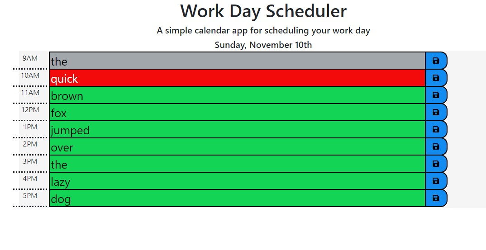

# Homework-05-DayPlanner
simple calendar application that allows the user to save events for each hour of the day

## Table of contents
* [General info](#general-info)
* [Instruction](#instructions)
* [Screenshots](#screenshots)
* [Features](#features)

## General info
Create a simple calendar application that allows the user to save events for each hour of the day. This app will run in the browser and feature dynamically updated HTML and CSS powered by jQuery.

## Instructions
AS AN employee with a busy schedule  
I WANT to add important events to a daily planner  
SO THAT I can manage my time effectively

## Screenshots

## Features
List of features ready and TODOs for future development
* The current day is displayed at the top of the calendar 
* The application displays timeblocks for standard business hours (9 a.m. to 5 p.m.)  
* Each timeblock contains an input field and save button  
* Clicking a timeblock's "Save" button stores the input text in local storage, allowing the text to persist when the application is refreshed.
* Each timeblock is color coded to indicate whether it is in a past, present, or future hour.

To-do list:
* Update code to use Moment.js a 3rd party api
* Update localStorage processing to save under one entry
